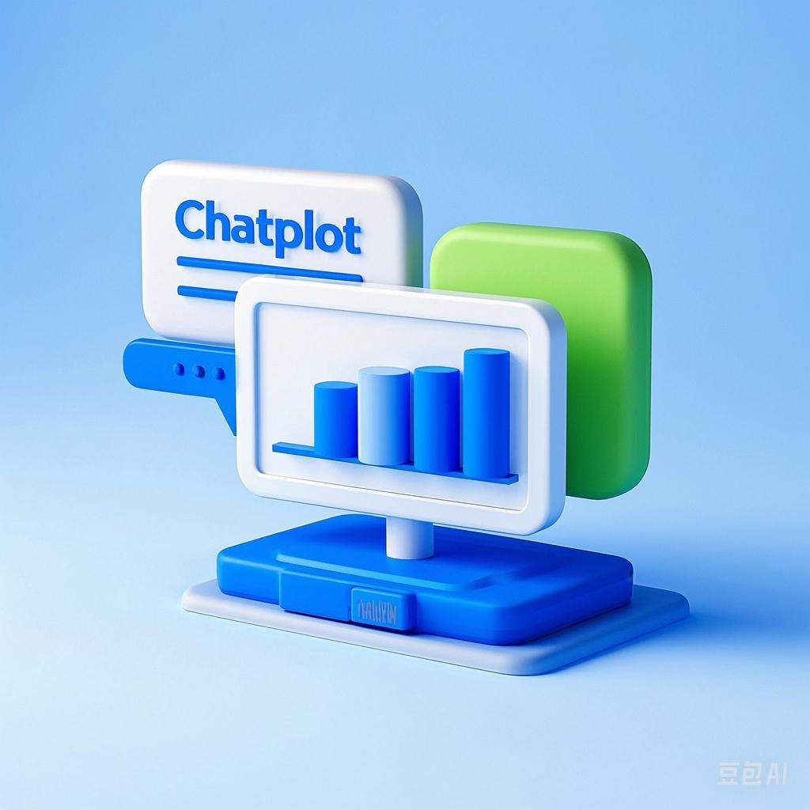

# ChatPlot 🚀

<div align="center">



[](https://www.python.org/downloads/)
[](https://reactjs.org/)
[](https://fastapi.tiangolo.com/)
[](LICENSE)

*An intelligent chat-based data visualization and analysis platform powered by Ollama* 🤖

[Features](#features) • [Quick Start](#quick-start) • [Documentation](#documentation) • [Contributing](#contributing)

</div>

## ✨ Features

### 🤖 Intelligent Chat Interface
- Natural language data analysis requests
- Context-aware conversations
- Smart visualization suggestions
- Interactive data exploration

### 📊 Advanced Data Analysis
- Time series analysis
- Pattern recognition
- Anomaly detection
- Market basket analysis
- Statistical computations

### 📈 Interactive Visualizations
- Dynamic chart generation
- Multiple chart types
- Customizable styling
- Real-time updates
- Export capabilities

### 🔌 Plugin System
- Extensible architecture
- Custom visualization plugins
- Data processing plugins
- Analysis plugins
- Model plugins

## 🚀 Quick Start

### Prerequisites
- Python 3.10 or higher
- Node.js 18 or higher
- Ollama
- Conda (recommended)

### Installation

1. Clone the repository
```bash
git clone https://github.com/yourusername/chatplot.git
cd chatplot
```

2. Create and activate Conda environment
```bash
conda env create -f environment.yml
conda activate chatplot
```

3. Set up environment variables
```bash
cp .env.example .env
# Edit .env with your configuration
```

4. Run the application
```bash
python start.py
```

The application will be available at `http://localhost:3000`

## 🏗️ Project Structure

```
chatplot/
├── backend/
│   ├── models/          # Database models
│   ├── services/        # Core services
│   ├── plugins/         # Plugin system
│   └── utils/           # Utility functions
├── frontend/
│   ├── src/
│   │   ├── components/  # React components
│   │   ├── services/    # API services
│   │   └── styles/      # CSS styles
│   └── public/          # Static assets
├── data/
│   ├── sample/          # Sample datasets
│   └── uploads/         # User uploads
└── docs/               # Documentation
```

## 💻 Development

### Backend Development
```bash
cd backend
pip install -r requirements.txt
uvicorn main:app --reload
```

### Frontend Development
```bash
cd frontend
npm install
npm run dev
```

### Plugin Development
See [Plugin Development Guide](docs/plugin_development.md)

## 🤝 Contributing

We welcome contributions! Please see our [Contributing Guidelines](CONTRIBUTING.md) for details.

1. Fork the repository
2. Create your feature branch
3. Commit your changes
4. Push to the branch
5. Open a Pull Request

## 📚 Documentation

- [API Documentation](docs/api.md)
- [Plugin Development](docs/plugin_development.md)
- [Architecture Overview](docs/architecture.md)
- [User Guide](docs/user_guide.md)

## 🗺️ Roadmap

- [ ] Enhanced natural language processing
- [ ] Additional visualization types
- [ ] Real-time collaboration features
- [ ] Advanced data processing plugins
- [ ] Mobile application

## 📄 License

This project is licensed under the MIT License - see the [LICENSE](LICENSE) file for details.

## 🙏 Acknowledgments

- [Ollama](https://ollama.ai/) for the language model
- [FastAPI](https://fastapi.tiangolo.com/) for the backend framework
- [React](https://reactjs.org/) for the frontend framework
- [Plotly](https://plotly.com/) for visualization libraries

## 📧 Contact

- Project Lead - [Jian Zhou](mailto:zhouj@ucas.ac.cn)

---

<div align="center">
Made with ❤️ by the ChatPlot Team
</div> 
